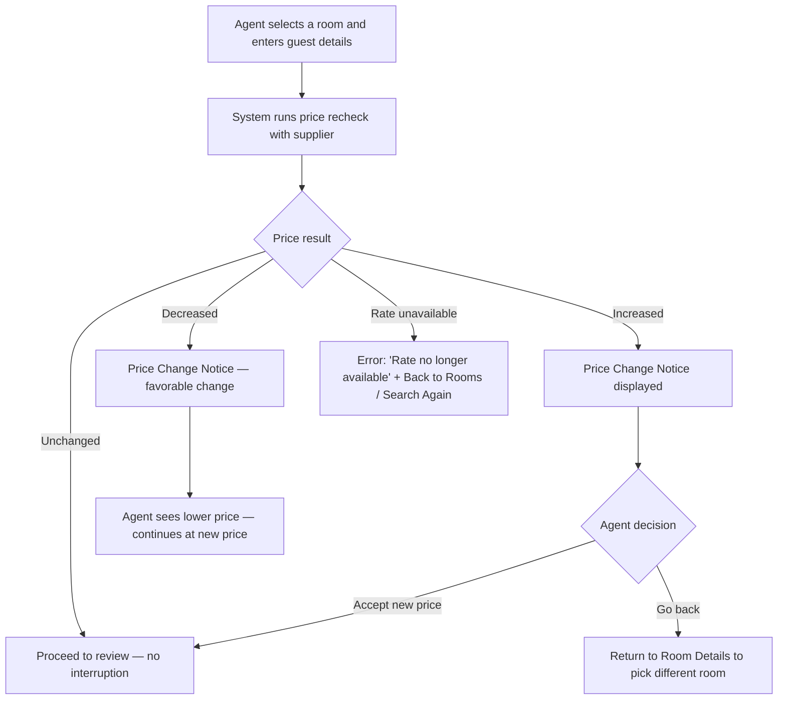
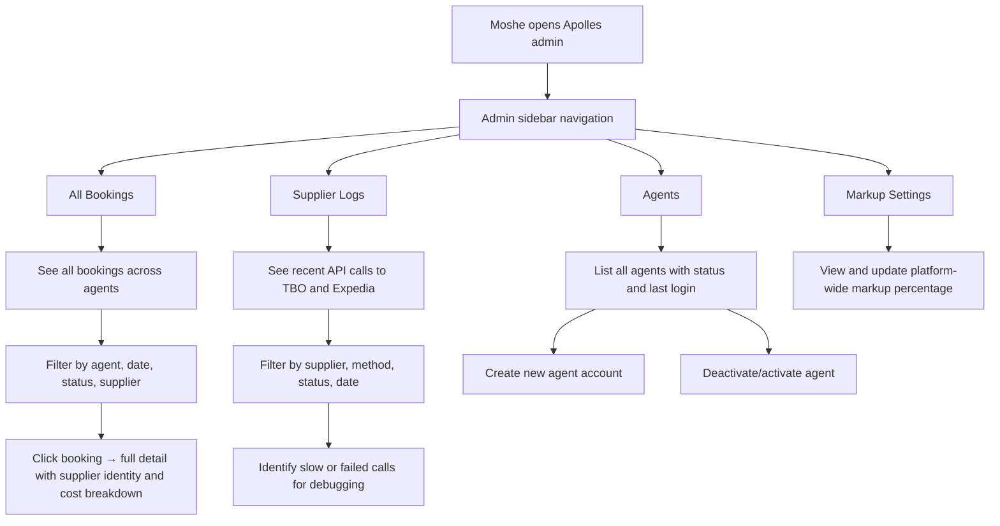

# UX Design Specification Apolles (Lean MVP)

**Author:** Moshe
**Date:** 2026-03-11
**Revision:** Lean scope alignment

---

## UX Alignment Summary

This is a scope-alignment revision of the existing UX design specification. The visual system, design direction, color palette, typography, component library choice, and overall UI structure are **preserved**. Only flows, screens, states, and UX logic that conflict with the approved lean product brief (2026-03-11) and lean PRD (2026-03-11) have been changed.

**Source of truth clarification:** This UX specification is aligned to the **approved lean PRD (prd.md, dated 2026-03-11)**, which defines a dual-supplier MVP (TBO + Expedia from day one). The product brief file (product-brief-Apolles-2026-03-11.md) still contains language suggesting a TBO-first / Expedia-later phasing in some sections, but the PRD supersedes it on supplier scope. Wherever the brief and PRD disagree on whether Expedia is MVP or Phase 2, the PRD is authoritative. This UX treats both suppliers as MVP Core.

### What Was Preserved

- **Visual identity**: Color palette (#635BFF primary, #0A2540 dark sidebar, #F6F9FC surface, full status color system), flat/no-gradient aesthetic, Stripe-inspired professional feel
- **Design system**: shadcn/ui + Tailwind CSS + Radix UI on React/Next.js
- **Typography**: Inter primary, JetBrains Mono for codes/numbers, full type scale
- **Layout direction**: Classic SaaS Dashboard (Direction 1) — dark sidebar + card grid
- **Spacing and layout foundation**: 4px base unit, 240px sidebar, 12-column grid, 1440px max-width
- **Component library strategy**: shadcn/ui foundation + custom Apolles components
- **Accessibility strategy**: WCAG 2.1 AA, Radix primitives, full keyboard/screen reader support
- **Responsive strategy**: Desktop-first, tablet/mobile as secondary
- **Feedback patterns**: Toast system (Sonner), inline feedback, status badges
- **Form patterns**: Single column, label above field, validation strategy
- **Navigation patterns**: Sidebar primary, back navigation, page transitions
- **Modal patterns**: Confirmation gates for high-stakes actions
- **Empty states and loading states**: Skeleton screens, progressive loading
- **Micro-interaction patterns**: All animation timings and rules
- **Button hierarchy**: Primary/Secondary/Ghost/Destructive/Link system
- **Data table patterns**: Sticky headers, row click, pagination, responsive collapse
- **Keyboard shortcuts**: Core shortcuts preserved
- **Performance guardrails**: LCP, INP, CLS targets
- **Testing strategy**: Responsive and accessibility testing matrices
- **Implementation guidelines**: Responsive and accessibility development rules
- **Next.js App Router boundary map**: Server/client component strategy

### What Was Changed

- **Executive Summary**: Rewritten for lean MVP scope (no mapping, no dedup, dual-supplier, no wallet, no quotes, no HCN)
- **Target Users**: Simplified to two roles only (Yael — Agent, Moshe — Admin). Removed David (Agency Owner) and Noa (Sub Agent).
- **Key Design Challenges**: Replaced multi-supplier dedup challenge with dual-supplier no-dedup challenge. Removed wallet awareness, quote builder session challenge, HCN background monitoring. Added: dual-supplier result disambiguation, Expedia payment step, price recheck UX.
- **Core User Experience**: Rewritten. Primary loop is now Search-to-Book-to-Voucher (not Search-to-Quote). No quote builder workflow. No HCN automation workflow.
- **User Journey Flows**: Replaced with lean journeys matching PRD (Daily Booking Flow, Price Change During Booking, Admin Monitoring). Removed: Onboarding/Setup Wizard journey, HCN Mismatch Recovery journey, Quote Builder journey.
- **Hotel Card**: Removed "Add to Quote" primary action. "Book" is now primary. Removed wallet insufficiency flag. Added neutral source indicator badge.
- **Sidebar navigation**: Simplified. Removed: Quotes, HCN Dashboard, Voucher Queue, Wallet. Kept: Search (Home), Reservations, Admin section.
- **Component Strategy**: Removed WalletWidget, QuoteIndicator, QuoteTemplateSelector, QuotePDFPreview, HCNTimeline, AutoCancelCountdown, RateComparisonTable. Added SourceIndicatorBadge, PriceChangeNotice, PaymentFieldsContainer.
- **StatusBadge variants**: Simplified. Removed all HCN, wallet, quote, and auto-cancel variants. Kept booking status variants. Added `booking-pending`, `booking-price-changed`, `booking-failed`.
- **Search results UX**: Added dual-supplier progressive loading, partial failure handling, neutral source indicators, supplier unavailability banner.
- **Booking flow**: Added price recheck step, price change decision screen, Expedia hosted payment fields step.
- **Page hierarchy**: Simplified from 8 pages to 5 agent pages + 3 admin pages.
- **Confirmation gate pattern**: Updated — no wallet deduction language, payment is handled by supplier flow.

### What Was Removed from Old UX Scope

| Removed UX Element | Reason |
|---|---|
| Wallet system (WalletWidget, wallet balance, wallet transactions, top-up flow, wallet page, wallet-gated booking indicator) | Wallet cut from MVP. Agents pay through supplier payment flows. |
| Quote builder (QuoteIndicator, QuoteTemplateSelector, QuotePDFPreview, quote workspace, quote history page, quote settings, quote flow, multi-city quote accumulation, re-search from quote) | Quote builder cut from MVP. Prove booking flow first. |
| HCN automation (HCNTimeline, HCN Dashboard, HCN mismatch recovery journey, HCN alerts, HCN status badges, HCN email configuration) | HCN automation cut from MVP. Agents verify manually. |
| Auto-cancellation (AutoCancelCountdown, auto-cancel warnings, progressive urgency states, voucher queue/batch) | Auto-cancellation cut from MVP. Manual cancellation sufficient. |
| Agent self-registration and setup wizard (Journey 0, registration page, email verification, 3-step setup wizard) | Cut. Moshe onboards agents manually. |
| Workspace tabs for multi-client context switching | Cut. Simplify for MVP. Agents use browser tabs if needed. |
| Command palette (`Ctrl+K` global search) | Cut. Future power-user feature. |
| Profile branding/logo upload | Cut. No quote builder = no branded PDFs at MVP. |
| Secondary target users (David — Agency Owner, Noa — Sub Agent) | Cut. Two roles only at MVP: Agent and Admin. |
| Deduplication / unified hotel view / rate comparison across suppliers | Cut. No hotel mapping in MVP. Results are supplier-specific. |
| Multi-layer cascading markup UI | Cut. One platform-wide markup only. |
| Booking modification requests | Cut. Agents contact supplier directly. |
| Notification preferences | Cut. Hardcode defaults. |
| Invoice generation | Cut. Not needed for search-to-book. |
| Advanced admin dashboard | Cut. Replaced with minimal admin. |
| SSE/WebSocket real-time push updates | Cut. No features require push in MVP. |

---

## Executive Summary

### Project Vision

Apolles is a B2B hotel booking platform that replaces the fragmented multi-portal workflow travel agents endure today with a single system for searching, booking, and managing hotel reservations. The MVP delivers the shortest path from hotel search to confirmed booking: search, view rooms, book with guest details, get confirmation, generate a voucher, manage reservations.

The platform launches with two suppliers from day one: TBO Holidays and Expedia Rapid API. Both are queried in parallel on every search. Results from each supplier are displayed independently — there is no hotel mapping, no deduplication, and no cross-supplier merging in MVP. The same physical hotel may appear twice (once from each supplier) and that is acceptable. When an agent selects a rate, booking continues with whichever supplier returned that rate.

The UX must serve as a competitive differentiator: a modern, fast, intuitive interface in a market where everything else looks like 2010. Agents get a responsive, well-designed booking experience that respects their time.

### Target Users

**Primary (MVP): Yael — Freelance Travel Agent**
- One-person operation, 2-10 bookings/day
- Uses 2-3 supplier portals daily with bad UX
- Needs: one clean interface to search, book, get a voucher, and track reservations
- Works primarily at a desk (desktop/laptop)
- Intermediate tech-savviness — expects intuitive, modern tools
- Success: completes search-to-voucher in under 5 minutes

**Admin: Moshe — Platform Owner / Operator**
- Founder and operator. Onboards agents manually. Monitors platform health.
- Needs: see all bookings, check supplier errors, manage agent accounts
- Controls platform-wide markup percentage

### Key Design Challenges

1. **Two suppliers, no deduplication**: Results from TBO and Expedia are displayed independently. The same hotel may appear twice at different prices. The UX must help agents understand this without revealing supplier identity. Neutral source indicators ("Source A" / "Source B") provide disambiguation without brand exposure.

2. **Progressive loading with partial failure**: Two supplier APIs may respond at different speeds or one may fail. The UX must show results as they arrive (progressive loading), clearly indicate when one supplier is slow or unavailable, and provide retry actions — without blocking the responsive supplier's results.

3. **Price recheck and rate volatility**: Supplier rates can change between search and booking. The price recheck step must clearly communicate price changes and give the agent a confident decision point (proceed at new price or go back).

4. **Expedia payment step**: Expedia bookings require card capture via hosted payment fields (Stripe Elements iframe). This adds an extra step to the Expedia booking flow that doesn't exist for TBO. The UX must handle this cleanly without confusing agents about why payment is sometimes required.

5. **High-stakes irreversible actions**: Non-refundable bookings are commitments. Critical moments must be unmistakably clear without creating friction on routine low-stakes actions.

6. **Information density with speed requirements**: Search results contain rooms from multiple suppliers with different cancellation policies, meal plans, bed types, and prices. The UX needs progressive disclosure — fast scanning for comparison, deep detail on demand.

### Design Opportunities

1. **Speed as a UX feature**: Progressive loading (first results in 2 seconds), minimal clicks from search to booking, clean scanning of results. The search-to-book flow should feel dramatically faster than any competitor portal.

2. **Modern UX for B2B**: A clean, fast interface in a market where everything else looks like 2010. This is the core competitive differentiator at MVP.

3. **Two suppliers, one search**: Agents search once and see results from both TBO and Expedia. No tab-switching between portals. Immediate value over any single-portal experience.

4. **Clean voucher PDF**: Professional voucher with hotel details, confirmation info, and agent company name. The artifact the client receives.

---

## Core User Experience

### Defining Experience

The core experience of Apolles at MVP is defined by one primary loop:

**Primary Loop — Search to Book to Voucher (the complete agent workflow):**
Client request arrives → Agent searches (one search, two suppliers) → Agent scans results → Agent selects a room → Agent enters guest details → Price recheck → Booking confirmed → Agent generates voucher PDF → Agent sends voucher to client

This loop happens multiple times daily. The target is under 5 minutes from search to voucher sent. This is the reason agents adopt Apolles — one tool, two suppliers, clean UX.

### Platform Strategy

- **Platform**: Web application (desktop-first, responsive for occasional mobile check-ins)
- **Primary input**: Mouse/keyboard (desktop power-user workflow)
- **Connectivity**: Strictly online — real-time supplier API data, no offline mode
- **Browser**: Modern browsers (Chrome, Edge, Safari, Firefox)
- **Language**: English only for MVP
- **RTL**: Not required at launch

### Effortless Interactions

**Must be effortless (zero cognitive load):**
- Scanning search results — hotel name, price, cancellation status immediately visible
- Filtering and sorting results — client-side, instant
- Navigating between search results and room details

**Must be clear but not burdensome:**
- Booking flow — clear display of cancellation policy, price breakdown, but streamlined steps
- Voucher generation — one click from reservation detail

**Must be deliberate and unmistakable:**
- Non-refundable booking confirmation — explicit consequences before commitment
- Price change acceptance — agent must actively accept the new price
- Booking cancellation (Late MVP) — penalty display with confirmation gate

### Critical Success Moments

1. **First search results** (Proof of concept): Seeing results from two suppliers in under 5 seconds, with a clean modern interface. Proves the aggregation value proposition instantly.

2. **First booking completion** (Confidence): Agent completes a booking without confusion about pricing, penalties, or room details. The flow communicates clearly what will happen at every step.

3. **First voucher generated** (Deliverable): Agent generates a clean PDF voucher and sends it to the client. The complete workflow works end to end.

### Experience Principles

1. **Speed-to-book is everything**: The defining metric is how fast an agent goes from search to confirmed booking. Every UX decision must optimize for fewer clicks, faster scanning, and instant actions.

2. **Real-time confidence**: All data is live from supplier APIs. The UX communicates freshness and handles price volatility gracefully — clear messaging without creating anxiety about rate changes.

3. **Background intelligence, foreground simplicity**: Supplier source tracking, markup application, and API routing happen invisibly. The foreground experience stays clean and focused on the active task.

4. **Graceful degradation, not failure**: When one supplier times out or errors occur, the system degrades gracefully with clear messaging. The agent never feels abandoned or confused. "One source is slow" is different from "something broke."

---

## Desired Emotional Response

### Primary Emotional Goals

**Core Emotion: Efficient and Modern**
Agents should feel that Apolles is a professional-grade tool that makes their work faster. The same work that takes switching between portals and manual processes takes a few minutes here.

**Error Emotion: Informed and Guided**
When something goes wrong (supplier timeout, price change, booking failure), the agent should feel informed — "I know exactly what happened" — and guided — "I know exactly what to do next." Every error state must have a clear explanation and a specific next action.

### Emotional Journey Mapping

| Stage | Target Emotion | Anti-Pattern to Avoid |
|-------|---------------|----------------------|
| First search results | Impressed, validated — "this works, and it's fast" | Skeptical about rate accuracy or confused by duplicate results |
| Core daily workflow | Efficient, in flow — "I'm getting more done" | Frustrated by extra steps or slow interactions |
| Price change during booking | Informed, in control — "I see what changed and I decide" | Anxious about surprise charges or confused about which price is real |
| Booking confirmation | Confident, accomplished — "I know what I committed to" | Anxious about charges, penalties, or unclear terms |
| Voucher generation | Satisfied — "I have what I need for the client" | Disappointed by missing info or ugly output |
| Supplier timeout / error | Informed, guided — "I see results from the other source, I can retry" | Confused by vague errors or stuck with no next action |
| Returning next day | Comfortable, ready — "I know where everything is" | Disoriented by unfamiliar layout |

### Design Implications

| Emotional Goal | UX Design Approach |
|---------------|-------------------|
| Efficient and modern | Minimal clicks, fast transitions, progressive loading, no unnecessary confirmations on routine actions |
| Informed and guided | Every error state includes: what happened (plain language), what it means (impact), what to do next (specific action button). No generic error messages. |
| Confidence over confusion | Clear state indicators everywhere (booking status, cancellation terms, price breakdown), explicit consequences before irreversible actions |
| Trust in data | Show search freshness context, transparent cancellation policies, consistent pricing display |

---

## UX Pattern Analysis & Inspiration

### Inspiring Products Analysis

**Stripe Dashboard — Financial Data Done Right**
- Data density without overwhelm: clean tables, clear hierarchy, status-coded color system
- Consistent visual language for states (succeeded, pending, failed)
- Error handling: every failure has a reason and suggested next action
- **Relevance**: Booking management, reservation list, admin views

**Figma / Notion — Modern SaaS Workspace Tools**
- Clean, uncluttered interfaces with generous whitespace despite being feature-rich
- Real-time, responsive feel
- Progressive disclosure: simple surface, depth on demand
- **Relevance**: Clean layout, progressive disclosure for room details

**Arbitrip — Best B2B Hotel Platform UX (Current Bar)**
- Cleaner search interface than legacy platforms
- Better visual hotel cards with scannable key information
- **Relevance**: The UX quality bar in the B2B hotel space — Apolles must exceed this

### Anti-Patterns to Avoid

| Anti-Pattern | Why to Avoid |
|-------------|-------------|
| Cluttered, information-overloaded search results | Agents can't scan quickly |
| Tiny text, dense forms, dated styling | Creates "cheap tool" feeling |
| Modal confirmation on every action | Slows agents down on routine tasks |
| Hidden or ambiguous cancellation policies | Creates booking anxiety |
| Full-page loading between workflow steps | Breaks flow state |
| Generic error messages ("Something went wrong") | No next action for agent |
| Revealing supplier identity to agents | Violates business rules — agents see neutral source indicators only |

---

## Design System Foundation

### Design System Choice

**Selected: shadcn/ui + Tailwind CSS** on React (Next.js)

shadcn/ui is a copy-paste component library built on Radix UI primitives with Tailwind CSS styling. Components are copied into the project — full control to customize.

**Core stack:**
- **shadcn/ui**: UI components (buttons, forms, tables, dialogs, badges, tabs, etc.)
- **Radix UI**: Accessible, composable headless primitives (underlying shadcn/ui)
- **Tailwind CSS**: Utility-first CSS framework for consistent styling
- **React / Next.js**: Application framework

### Rationale for Selection

1. **Aesthetic match**: shadcn/ui's default aesthetic is very close to Stripe and Notion — clean, minimal, professional typography, generous whitespace.
2. **Code ownership**: Components are copied into the project, not imported as a dependency. Full control to customize.
3. **Accessibility built-in**: Radix UI primitives provide WCAG-compliant keyboard navigation, focus management, screen reader support, and ARIA attributes out of the box.
4. **Development velocity**: Tailwind CSS enables rapid UI development with consistent design tokens. Ideal for vibe-coding approach.
5. **Component coverage**: Covers all critical Apolles UI needs: data tables, status badges, forms, dialogs, toast notifications.

---

## Visual Design Foundation

### Color System

**Primary Palette:**

| Token | Value | Usage |
|-------|-------|-------|
| `--primary` | `#635BFF` | Primary actions (buttons, links, active states). Apolles brand color. |
| `--primary-hover` | `#5046E5` | Hover state for primary elements |
| `--primary-light` | `#EEF0FF` | Primary tinted backgrounds (selected states, highlights) |
| `--dark` | `#0A2540` | Sidebar navigation, dark UI areas, high-contrast sections |
| `--dark-secondary` | `#1A3A5C` | Secondary dark elements, dark hover states |
| `--accent` | `#00D4FF` | Secondary accent — used sparingly for highlights, price callouts |

**Neutral Palette:**

| Token | Value | Usage |
|-------|-------|-------|
| `--surface` | `#F6F9FC` | Page background — cool blue-tinted off-white |
| `--card` | `#FFFFFF` | Card backgrounds, content containers |
| `--border` | `#D6E3F0` | Borders, dividers — blue-tinted for cohesion |
| `--border-subtle` | `#E8EDF4` | Subtle borders, inner dividers |
| `--text-primary` | `#1F2937` | Primary text — dark blue-gray |
| `--text-secondary` | `#6B7280` | Secondary text, metadata, labels |
| `--text-muted` | `#9CA3AF` | Disabled text, placeholder text |

**Status Colors (Muted, professional tones):**

| Token | Value | Usage |
|-------|-------|-------|
| `--success` | `#059669` | Confirmed, completed. Booking confirmed. |
| `--success-bg` | `#ECFDF5` | Success background tint |
| `--warning` | `#D97706` | Pending, attention needed. Price changed. |
| `--warning-bg` | `#FFFBEB` | Warning background tint |
| `--error` | `#DC2626` | Error, failed. Booking failed, supplier error. |
| `--error-bg` | `#FEF2F2` | Error background tint |
| `--info` | `#2563EB` | Informational states. Pending booking. |
| `--info-bg` | `#EFF6FF` | Info background tint |
| `--neutral` | `#6B7280` | Inactive, cancelled, archived. |
| `--neutral-bg` | `#F3F4F6` | Neutral background tint |

**Status Color Application (Lean MVP):**

| Status | Color Token | Examples |
|--------|------------|---------|
| Booking: Pending | `--info` | Blue badge — awaiting supplier confirmation |
| Booking: Price Changed | `--warning` | Amber badge — agent decision required |
| Booking: Confirmed | `--success` | Green badge — confirmed with supplier |
| Booking: Failed | `--error` | Red badge — supplier rejected or system error |
| Booking: Cancelled | `--neutral` | Gray badge — final state |
| Supplier: Available | No indicator | Default — no visual noise |
| Supplier: Unavailable | `--warning` | Amber banner in results |
| Supplier: Failed | `--error` | Red indicator — retry available |

**Color Mode:** Light mode only for MVP. Design token architecture supports future dark mode.

### Typography System

**Font Family:**

| Role | Font | Fallback |
|------|------|----------|
| Primary (UI) | Inter | system-ui, -apple-system, sans-serif |
| Monospace (codes, numbers) | JetBrains Mono | ui-monospace, monospace |

**Type Scale:**

| Level | Size | Weight | Line Height | Usage |
|-------|------|--------|-------------|-------|
| Display | 30px | 700 (Bold) | 1.2 | Page titles ("Hotel Search", "Reservations") |
| H1 | 24px | 600 (Semibold) | 1.3 | Section headers |
| H2 | 20px | 600 (Semibold) | 1.3 | Sub-section headers |
| H3 | 16px | 600 (Semibold) | 1.4 | Card titles (hotel name), table headers |
| Body | 14px | 400 (Regular) | 1.5 | Default text, descriptions, form labels |
| Body (emphasis) | 14px | 500 (Medium) | 1.5 | Prices, important values, inline emphasis |
| Small | 13px | 400 (Regular) | 1.4 | Secondary info, metadata, timestamps |
| Caption | 12px | 400 (Regular) | 1.4 | Labels, badges, helper text |
| Micro | 11px | 500 (Medium) | 1.3 | Status badges, counters, source indicators |

**Typography Principles:**
- Prices always displayed in medium weight (500) for scanability
- Hotel names in semibold (600) — the most scanned element on result cards
- Status text uses the `Micro` scale with matching status color
- Monospace font for booking reference numbers, confirmation codes

### Spacing & Layout Foundation

**Spacing Scale (4px base unit):**

| Token | Value | Usage |
|-------|-------|-------|
| `--space-1` | 4px | Tight: between icon and label, badge padding |
| `--space-2` | 8px | Compact: within components, between related items |
| `--space-3` | 12px | Default: between form fields, within cards |
| `--space-4` | 16px | Standard: section padding, between cards |
| `--space-5` | 20px | Comfortable: between distinct groups |
| `--space-6` | 24px | Spacious: between major sections |
| `--space-8` | 32px | Page-level: between page sections |
| `--space-10` | 40px | Large: page margins, major separations |

**Layout Structure:**

- **Sidebar navigation**: Fixed left sidebar (240px collapsed to 64px icon-only). Dark (`--dark`) background. Always visible.
- **Main content area**: Fluid width, responsive. `--surface` background.
- **Content max-width**: 1440px centered within the main area.
- **Card grid**: 12-column CSS grid within content area. Hotel cards: 3-column grid on desktop.
- **Page padding**: `--space-6` (24px) on sides, `--space-8` (32px) top.

---

## Design Direction

### Chosen Direction

**Direction 1: Classic SaaS Dashboard** — dark sidebar + card grid.

**Key Layout Decisions:**
- **Dark sidebar** (`#0A2540`) with persistent navigation — always visible, provides consistent context
- **Card grid** for search results — hotel cards in a responsive grid (3 columns on desktop)
- **Home page = Search engine** — after login, the agent lands directly on the hotel search page. Search is the primary action.
- **Clean, flat design** — no gradients anywhere. Solid colors only.

### Color Palette (Confirmed)

| Color | Value | Role |
|-------|-------|------|
| Dark / Sidebar | `#0A2540` | Sidebar background, dark UI areas |
| Primary / Brand | `#635BFF` | Primary actions, buttons, active states, links |
| Accent | `#00D4FF` | Secondary highlights, special indicators |
| Light Accent | `#E6F4FF` | Light blue tint for informational backgrounds |
| Surface | `#F6F9FC` | Page background, content area |
| Card | `#FFFFFF` | Card backgrounds, content containers |

No gradients. Flat, solid colors throughout.

---

## Defining Core Experience

### User Mental Model

**Current mental model (fragmented):**
- Each supplier portal = a separate tool with its own login, UI, and quirks
- Booking tracking = spreadsheets or memory
- The agent is the integration layer — holding everything together in their head

**Apolles mental model (unified booking tool):**
- One platform = one login, one interface
- Search both suppliers at once
- Book, confirm, generate voucher — all in one place
- Reservations list tracks everything

**Key mental model shift**: Agents are accustomed to switching between portals. Apolles replaces that with one search across two inventories. The agent may see the same hotel twice (from different sources) — the neutral source indicator helps them understand this without confusion.

### Success Criteria

1. **Agents stop opening separate portals**: Apolles becomes the primary booking tool.
2. **Search-to-voucher in under 5 minutes**: Search, book, confirm, voucher — complete flow in minutes.
3. **"This just works" feeling**: Agent completes a search-to-voucher cycle without confusion, without wondering "what do I do next?", without leaving Apolles.

---

## Page Hierarchy & Navigation

### MVP Core Pages (Agent-Facing)

| # | Page | Purpose | Entry Point |
|---|------|---------|-------------|
| 1 | **Login** | Email/password authentication | Direct URL |
| 2 | **Search (Home)** | Hotel search form + results grid | Default landing after login |
| 3 | **Room Details** | All rooms/rates for a selected hotel | Click hotel card from search results |
| 4 | **Booking Flow** | Guest details, price recheck, payment (Expedia), review, confirm | Click "Book" on a room |
| 5 | **Booking Confirmation** | Reference number, booking details, voucher generation | After successful booking |
| 6 | **Reservations List** | All agent bookings with filter/sort/search | Sidebar navigation |
| 7 | **Reservation Detail** | Full booking info, status, cancellation terms, voucher download | Click booking from reservations list |

### MVP Core Pages (Admin-Facing)

| # | Page | Purpose |
|---|------|---------|
| 8 | **Admin: Bookings** | All bookings across all agents with filters. Shows supplier identity. |
| 9 | **Admin: Supplier Logs** | Recent API calls — method, latency, status, errors. Filter by supplier. |
| 10 | **Admin: Platform Settings** | Agent management (list, create, deactivate) + platform markup configuration. Two sections on one page. |

### Late MVP Pages

| Page | Notes |
|------|-------|
| **Password Reset** | Email-based reset flow |
| **Booking Cancellation** | Cancel button on reservation detail + penalty display + confirmation gate |
| **Agent Settings** | Basic profile page: saved nationality/residency default, password change. Adds a Settings nav item to agent sidebar. |

### Phase 2 Pages (Not in MVP)

| Page | Notes |
|------|-------|
| Quote Builder | Multi-city quote composition and PDF generation |
| Quote History | Past quotes with re-search capability |
| Quote Settings | Template selection and branding customization |
| HCN Dashboard | Automated verification status and timeline |
| Wallet | Balance, top-up, transaction history |
| Agent Self-Registration | Public registration flow |
| Advanced Admin Dashboard | Analytics, metrics, performance data |

### Sidebar Navigation (MVP)

**Agent sidebar:**

| Nav Item | Icon | Page | Badge |
|----------|------|------|-------|
| Search | Search icon | Search (Home) | — |
| Reservations | BookOpen icon | Reservations List | — |

No agent settings page at MVP. The PRD core scope does not define agent-configurable settings. Nationality/residency (required by supplier APIs) is entered per search on the search form. Logout is always available from the sidebar bottom user area (agent name + logout action). A basic agent settings page (saved nationality default, password change) is a Late MVP addition.

**Admin sidebar (additional items):**

| Nav Item | Icon | Page | Badge |
|----------|------|------|-------|
| All Bookings | Database icon | Admin: Bookings | — |
| Supplier Logs | Activity icon | Admin: Supplier Logs | — |
| Platform Settings | Settings icon | Admin: Platform Settings (agents + markup) | — |

**Sidebar structure:**
- Top: Apolles logo / brand
- Main section: Agent navigation items (Search, Reservations)
- Admin section (admin only): Admin navigation items, visually separated
- Bottom: Agent name / avatar, logout action

The sidebar is deliberately simple at MVP. No wallet widget, no quote indicator, no HCN alerts, no agent settings page. These are Late MVP or Phase 2 additions.

---

## Dual-Supplier Search UX

### How Two Suppliers Appear in One Search

When an agent searches, the system queries TBO and Expedia in parallel. Results arrive independently and may arrive at different times.

**Progressive Loading Sequence:**

1. Agent clicks "Search"
2. Skeleton card grid appears immediately (6-9 skeleton cards)
3. Header shows: "Searching 2 sources..."
4. First supplier results arrive (~1-3 seconds) — skeleton cards replaced with real hotel cards
5. Header updates: "47 hotels from Source A — searching Source B..."
6. Second supplier results arrive — appended to existing results, grid re-sorts
7. Header updates: "82 hotels from 2 sources"

**Partial Failure Handling:**

| Scenario | UX Response |
|----------|-------------|
| Both suppliers respond | "82 hotels from 2 sources" — normal state |
| One supplier slow (> 3s) | Show available results immediately. Banner: "Source B is taking longer than usual..." with spinner |
| One supplier fails/times out | Show available results. Warning banner: "Results from 1 source. Source B unavailable. [Retry]" |
| Both suppliers fail | Error state: "Unable to load results. [Retry All]" |
| One supplier returns 0 results | Show other supplier's results. Info note: "No results from Source B for these dates." |

**Banner Design (supplier unavailability):**
- Positioned above the results grid, below filters
- Uses `--warning-bg` background with `--warning` left border (4px)
- Clear text: "Showing results from 1 source. Source B is unavailable."
- Action button: "[Retry Source B]" — ghost button style
- Dismissible after retry attempt
- Never blocks or hides available results

### Neutral Source Indicators

**Purpose:** Because the same physical hotel may appear twice (once from each supplier), agents need a way to distinguish results without seeing supplier names.

**Implementation:**
- Each search result card shows a small badge: "Source A" or "Source B"
- Badge uses the `Micro` type scale (11px, medium weight)
- Badge color: `--neutral-bg` background with `--text-secondary` text — deliberately subtle
- Source labels are consistent within a search session: all TBO results share one label, all Expedia results share another
- Labels do not reveal supplier identity to agents
- The badge position: top-right corner of the hotel card, below the hotel image

**Agent-facing explanation (help text on first encounter):**
"Hotels may appear from different sources with different prices and policies. The source label helps you compare options for the same hotel."

**Admin sees full supplier identity:** In admin views (Admin: Bookings, Admin: Supplier Logs), the actual supplier name (TBO / Expedia) is displayed instead of neutral labels.

### Search Results Layout

**Hotel Card Grid:**
- 3-column grid on desktop (xl+)
- 2-column on tablet (md-lg)
- 1-column full-width on mobile (< md)
- Each card is a `<article>` with hotel info

**Filter Bar (above results):**
- Price range slider
- Star rating checkboxes (1-5)
- Cancellation toggle: "Free cancellation only"
- Sort dropdown: Price (low-high), Price (high-low), Star rating
- Active filters shown as removable chips
- "Clear all filters" link when filters active
- Result count: "Showing 23 of 82 hotels"

**Filters are client-side** — applied to already-fetched results. Instant, no API call.

---

## Hotel Result Card (MVP)

### Content

- Hotel image (or flat color placeholder)
- Hotel name (semibold, clickable → Room Details page)
- Star rating (1-5 stars as icons)
- Starting price (cheapest rate, bold, prominent — with markup applied)
- Source indicator badge ("Source A" / "Source B") — `Micro` size, subtle
- Meal basis badge (e.g., "Breakfast Included", "Room Only")
- Cancellation policy badge (e.g., "Free cancel until Apr 10", "Non-refundable")
- Location / area (if provided by supplier)

### Actions

- **"View Rooms"** — Primary button. Navigates to Room Details page showing all available rooms and rates for this hotel.
- **"Book"** — Secondary button. Navigates directly to booking form for the cheapest displayed rate (shortcut for agents who don't need to compare rooms).

### States

| State | Visual Treatment |
|-------|-----------------|
| Default | White card, subtle border, normal shadow |
| Hover | Slight elevation increase, border tint |
| Loading (Skeleton) | Skeleton placeholder matching card layout |

### Accessibility

- Card is a `<article>` with `aria-label="[Hotel Name], [Star Rating] stars, from $[Price]"`
- Action buttons have explicit labels: `aria-label="View rooms at [Hotel Name]"`, `aria-label="Book [Hotel Name]"`
- Star rating: `aria-label="[N] out of 5 stars"`
- Source indicator: `aria-label="From Source [A/B]"`

---

## Room Details Page

### Purpose

Display all available rooms and rates for a single hotel. Agents compare rooms by bed type, cancellation policy, meal plan, and price before selecting one to book.

### Layout

- **Header**: Hotel name, star rating, source indicator, location
- **Room list**: Table or card list showing each available room

### Room Row Content

| Field | Display |
|-------|---------|
| Room name | Semibold (e.g., "Deluxe Double Room") |
| Bed type | Regular text (e.g., "1 King Bed") |
| Meal plan | Badge (e.g., "Breakfast Included", "Room Only") |
| Cancellation policy | Clear text with dates: "Free cancellation until Apr 10, 2026" or "Non-refundable" |
| Cancellation penalty | If applicable: "Penalty: $150 after Apr 10" |
| Refundability | Badge: "Refundable" (green) or "Non-refundable" (amber) |
| Total price | Bold, medium weight. Includes taxes/fees where provided. |
| Taxes/fees breakdown | Small text below price. For Expedia: includes legally mandated tax disclaimer. |
| "Book This Room" | Primary button per row |

### Expedia Tax Disclaimer

For rooms sourced from Expedia, display the legally mandated text below the price:

> "The taxes are tax recovery charges paid to vendors (e.g. hotels); for details, please see our Terms of Use. Service fees are retained as compensation in servicing your booking and may include fees charged by vendors."

This text appears only on Expedia-sourced rates. TBO rates show TBO-specific tax display per their certification requirements.

### Back Navigation

"Back to Results" button in page header. Returns to search results with scroll position and filters preserved.

---

## Booking Flow

### Overview

The booking flow is a multi-step process from room selection to confirmation. The flow differs slightly depending on the supplier (Expedia requires a payment step).

### Step 1: Guest Details

**Form fields:**
- Guest full name (required) — text input
- Guest email (optional) — email input
- Guest phone (optional) — phone input
- Special requests (optional) — textarea, free text

**Form layout:** Single column. Label above field. Required fields marked with asterisk.

**Pre-fill behavior:**
- All fields start blank (different guest per booking)

### Step 2: Price Recheck

After the agent enters guest details and clicks "Continue," the system performs a price recheck with the originating supplier.

**Price Recheck UX:**

| Scenario | UX Response |
|----------|-------------|
| Price unchanged | Proceed silently to review step. No interruption. |
| Price increased | **Price Change Notice** (see below) |
| Price decreased | **Price Change Notice** (favorable — proceed with lower price, agent informed) |
| Rate no longer available | Error: "This rate is no longer available. [Back to Rooms] [Search Again]" |
| Supplier timeout | Error: "Unable to verify the rate. Please try again. [Retry] [Back to Rooms]" |

**Price Change Notice:**

A full-width yellow banner at the top of the booking form:

```
┌──────────────────────────────────────────────┐
│  ⚠ Price changed                              │
│                                                │
│  The rate for this room has changed since      │
│  your search.                                  │
│                                                │
│  Original price: $1,247.00                     │
│  Updated price:  $1,277.00  (+$30.00)         │
│                                                │
│  [Back to Rooms]        [Continue at $1,277]   │
└──────────────────────────────────────────────┘
```

- Background: `--warning-bg`
- Left border: 4px `--warning`
- Original price: strikethrough, `--text-secondary`
- Updated price: bold, `--text-primary`
- Difference: inline, `--warning` color
- "Back to Rooms" = ghost button (left)
- "Continue at $X" = primary button (right)

### Step 3: Payment (Expedia Only)

For Expedia-sourced bookings, the agent must provide card details via hosted payment fields.

**Payment Step UX:**

- Section header: "Payment Details"
- Explanation text: "Card details are required to complete this booking. Your card information is securely processed and never stored on our servers."
- Hosted payment fields iframe (Stripe Elements or equivalent): card number, expiry, CVC
- The iframe is styled to match Apolles design tokens (Inter font, matching border radius, matching input heights)
- Below the iframe: security badge / PCI compliance indicator — small text: "Secured by [payment provider]"
- This step appears ONLY for Expedia bookings. TBO bookings skip this step entirely (TBO uses credit-based payment through existing arrangement).

**Why payment is sometimes required (agent-facing help text):**
"Some sources require card details to complete the booking. This depends on the source providing the rate."

This avoids revealing which supplier requires payment while explaining the difference honestly.

### Step 4: Booking Summary / Review

**Displayed information:**
- Hotel name, location
- Room type, bed configuration
- Check-in / check-out dates
- Number of nights
- Guest name(s)
- Meal plan
- Cancellation policy (with dates and penalty amounts)
- Total price (post-recheck, with markup applied)
- Taxes and fees breakdown
- For Expedia: mandated display elements (tax disclaimer, payment processing country)

**Actions:**
- "Back" (ghost button) — return to edit guest details
- "Confirm Booking" (primary button) — submit to supplier

**Non-refundable booking enhancement:**
If the rate is non-refundable, the review page shows an explicit warning:

```
⚠ This booking is non-refundable
Once confirmed, this booking cannot be cancelled or refunded.
Total charge: $1,247.00
```

### Step 5: Booking Confirmation

**On success:**
- Header: "Booking Confirmed" with success icon (green checkmark)
- Apolles booking ID (monospace, copyable)
- Supplier reference number (monospace, copyable — agent sees this as "Confirmation Number")
- Hotel name, room type, dates, guest name, total price
- Cancellation terms summary
- "Generate Voucher" button (primary) — generates PDF immediately
- "Go to Reservations" link — navigates to reservations list

**On failure:**
- Header: "Booking Failed" with error icon
- Failure reason in plain language (e.g., "The rate is no longer available", "Supplier could not process the booking")
- Actions: "[Search Again]" "[Try Another Room]"

---

## Voucher Generation

### Trigger

From either:
- Booking Confirmation page: "Generate Voucher" button
- Reservation Detail page: "Generate Voucher" or "Download Voucher" button

### Voucher PDF Content

- Hotel name
- Hotel address
- Check-in date
- Check-out date
- Room type
- Guest name(s)
- Confirmation number (supplier reference)
- Agent company name
- Applicable legal/tax disclaimer text (supplier-specific, but without revealing supplier name)

### Voucher UX

- One voucher per booking (no queue, no batch)
- Generation takes < 5 seconds
- Button shows spinner during generation, then "Download" action
- PDF opens in new tab or downloads depending on browser
- Once generated, voucher is accessible from Reservation Detail page permanently

---

## Reservations List

### Purpose

Agent views all their bookings. Filter, sort, search, and click through to details.

### Table Columns

| Column | Content |
|--------|---------|
| Booking Ref | Apolles booking ID (monospace). Clickable → Reservation Detail. |
| Hotel | Hotel name |
| Guest | Guest full name |
| Check-in | Check-in date ("Mar 15, 2026") |
| Check-out | Check-out date |
| Status | StatusBadge — all PRD lifecycle states: pending, price_changed, confirmed, failed, cancelled |
| Total | Price (medium weight) |
| Actions | "View" link, "Voucher" download link (if confirmed) |

### Filters

- Status: Pending, Confirmed, Failed, Cancelled (checkbox group). `price_changed` is a transient state and does not appear in reservation filters — it resolves to `pending` (agent accepts) or no record (agent abandons) before a booking record is persisted.
- Date range: Check-in date range picker
- Search: Text input — searches guest name or booking reference

### Sort

Default: newest first (by booking date). Sortable by: date, status, hotel name, price.

### Empty State

"No bookings yet. Search for hotels to make your first booking." + "[Go to Search]" button.

---

## Reservation Detail Page

### Purpose

Full booking information for a single reservation. The agent's primary reference page for any booking.

### Layout

**Header:**
- Hotel name (H1)
- StatusBadge — shows the current PRD lifecycle state: pending, confirmed, failed, or cancelled
- Apolles booking ID (monospace, copyable)
- Back link: "← Back to Reservations"

**Section 1: Booking Details**
- Confirmation number (monospace, copyable — labeled as "Confirmation Number")
- Hotel name and address
- Check-in / check-out dates
- Number of nights
- Room type and bed configuration
- Meal plan
- Guest name(s), email, phone, special requests

**Section 2: Pricing**
- Total price paid (confirmed amount — immutable)
- Taxes/fees breakdown (as shown at booking time)
- For Expedia bookings: mandated tax disclaimer text

**Section 3: Cancellation Terms**
- Full cancellation policy with dates and penalty amounts
- Clear display: "Free cancellation until [date]" or "Non-refundable"
- If free cancellation period has passed: "Cancellation penalty: $[amount]"
- Cancellation action button: **Late MVP** — not in day-one core. The button appears here when implemented.

**Section 4: Voucher**
- If voucher already generated: "Download Voucher" button (immediate PDF download)
- If voucher not yet generated: "Generate Voucher" button (generates then downloads)

**Source indicator (agent view):**
- Source indicator badge visible ("Source A" / "Source B") — same neutral label as search results
- No supplier name shown to agents

**Admin view additions:**
- Actual supplier name (TBO / Expedia) displayed explicitly
- Supplier reference number labeled with supplier name
- Supplier cost vs. markup vs. agent price breakdown visible

---

## Minimal Admin UX

### Admin: Bookings

**Purpose:** Moshe sees all bookings across all agents for support and monitoring.

**Table columns (superset of agent reservations list):**

| Column | Content |
|--------|---------|
| Booking Ref | Apolles booking ID |
| Supplier | Actual supplier name (TBO / Expedia) — admin only |
| Agent | Agent name |
| Hotel | Hotel name |
| Guest | Guest name |
| Check-in | Date |
| Status | StatusBadge |
| Total (Agent) | Agent-visible price |
| Total (Supplier) | Supplier cost — admin only |
| Markup | Calculated markup amount — admin only |

**Filters:** By agent, by date range, by status, by supplier.

**Row click:** Opens full booking detail with admin-level visibility (supplier name, cost breakdown).

### Admin: Supplier Logs

**Purpose:** Moshe debugs supplier API issues.

**Table columns:**

| Column | Content |
|--------|---------|
| Timestamp | When the API call was made |
| Supplier | TBO / Expedia |
| Method | search, priceCheck, book, cancel, getBookingDetail |
| Latency | Response time in ms |
| HTTP Status | 200, 400, 500, timeout, etc. |
| Status | Success / Error badge |
| Error | Error message (if any) — truncated, expandable |

**Filters:** By supplier, by method, by status (success/error), by date range.

**Key UX:** Most recent logs first. Error rows highlighted with `--error-bg` background. Click to expand full error details.

### Admin: Platform Settings

**Purpose:** Single admin page for agent management and platform markup. Two sections on one page, separated by `Separator` component.

**Section 1: Agents**

**Table columns:**

| Column | Content |
|--------|---------|
| Name | Agent full name |
| Email | Agent email |
| Status | Active / Inactive badge |
| Created | Date created |
| Last Login | Last login date |
| Actions | "Deactivate" / "Activate" button |

**Actions:**
- "Create Agent" button (top of section) → opens form: name, email, initial password
- Per-row: Activate / Deactivate toggle

**Section 2: Platform Markup**

**Simple form:**
- Current markup: displayed prominently (e.g., "12%")
- Input field: percentage input
- "Save" button
- Confirmation: "Markup updated to 12%. All future searches will use this rate."
- Note: "This does not affect existing confirmed bookings."

---

## Component Strategy

### Design System Components (shadcn/ui Coverage)

**Available from shadcn/ui (direct use or minor customization):**

| Component | shadcn/ui Name | Apolles Usage |
|-----------|---------------|---------------|
| Button | `Button` | Primary ("Book", "Confirm"), Secondary, Ghost, Destructive |
| Input | `Input` | Search fields, booking form fields, admin settings |
| Select | `Select` | Sort dropdown, filter dropdowns, nationality/residency |
| DatePicker | `Calendar` + `Popover` | Check-in/out date selection |
| Table | `Table` | Reservations list, admin bookings, supplier logs, agents |
| Dialog | `Dialog` | Confirmation gates (non-refundable booking, cancellation) |
| Badge | `Badge` | Meal basis, cancellation policy, source indicator |
| Toast | `Toast` (Sonner) | "Voucher generated", "Booking confirmed" feedback |
| Tooltip | `Tooltip` | Truncated text, icon-only actions |
| Dropdown | `DropdownMenu` | More actions menus |
| Skeleton | `Skeleton` | Progressive loading states for hotel cards, tables |
| Separator | `Separator` | Section dividers |
| ScrollArea | `ScrollArea` | Sidebar navigation |
| Card | `Card` | Base container for hotel cards |
| Accordion | `Accordion` | Expandable booking details, cancellation policy details |

### Custom Components (Apolles-Specific)

#### HotelResultCard

**Purpose:** Display a single hotel in search results. The primary unit of search result interaction.

**Content:** Hotel image, name, stars, starting price, source indicator, meal badge, cancellation badge, location.

**Actions:**
- **"View Rooms"** — Primary button. Navigates to Room Details page.
- **"Book"** — Secondary button. Navigates directly to booking form for cheapest rate.

**States:** Default, Hover, Loading (Skeleton).

**Accessibility:**
- `<article>` with `aria-label="[Hotel Name], [Star Rating] stars, from $[Price]"`
- Action buttons with explicit labels
- Source indicator announced: `aria-label="From Source [A/B]"`

---

#### StatusBadge

**Purpose:** Single reusable component for all status indicators. Enum-driven via `variant` prop.

**Variants (Lean MVP):**

| Variant | Color Token | Icon | Label |
|---------|------------|------|-------|
| `booking-pending` | `--info` | Clock | "Pending" |
| `booking-price-changed` | `--warning` | AlertTriangle | "Price Changed" |
| `booking-confirmed` | `--success` | CheckCircle | "Confirmed" |
| `booking-failed` | `--error` | XCircle | "Failed" |
| `booking-cancelled` | `--neutral` | XCircle | "Cancelled" |
| `agent-active` | `--success` | CheckCircle | "Active" |
| `agent-inactive` | `--neutral` | XCircle | "Inactive" |
| `supplier-available` | `--success` | CheckCircle | "Available" |
| `supplier-error` | `--error` | AlertTriangle | "Error" |
| `api-success` | `--success` | CheckCircle | "Success" |
| `api-error` | `--error` | XCircle | "Error" |

**Implementation:**

```tsx
interface StatusBadgeProps {
  variant: StatusVariant;
  size?: 'sm' | 'md';
  showIcon?: boolean;
}
```

**Accessibility:**
- `role="status"` with `aria-label="Status: [label]"`
- Color is never the sole indicator — always icon + text
- High contrast on both white and tinted backgrounds

---

#### SourceIndicatorBadge

**Purpose:** Display the neutral source label on hotel cards and booking details. Agent never sees supplier name.

**Content:** "Source A" or "Source B" text badge.

**Visual treatment:**
- `Micro` type scale (11px, medium weight)
- `--neutral-bg` background, `--text-secondary` text
- Rounded corners (4px border radius)
- Deliberately subtle — informational, not attention-grabbing

**Placement:** Top-right corner of hotel result cards. Inline in booking detail header.

**Accessibility:** `aria-label="From Source [A/B]"`

---

#### PriceChangeNotice

**Purpose:** Full-width banner displayed when price recheck returns a different amount.

**Content:**
- Warning icon
- Explanation: "The rate for this room has changed since your search."
- Original price (strikethrough)
- Updated price (bold)
- Difference (inline, color-coded: amber for increase, green for decrease)
- Actions: "Back to Rooms" (ghost), "Continue at $X" (primary)

**Visual treatment:**
- `--warning-bg` background, `--warning` left border (4px)
- Positioned at top of booking form, above guest details

---

#### PaymentFieldsContainer

**Purpose:** Container for Stripe Elements hosted payment fields (Expedia bookings only).

**Content:**
- Section header: "Payment Details"
- Explanation text about secure processing
- Stripe Elements iframe (card number, expiry, CVC)
- Security indicator

**Visual treatment:**
- Styled to match Apolles design tokens
- Input fields within iframe match Apolles input height, border radius, font
- Border: `--border` color
- On focus: `--primary` border (matching Apolles focus style)

**Conditional rendering:** This component renders ONLY for Expedia-sourced bookings. TBO bookings skip this step entirely.

---

#### SupplierStatusBanner

**Purpose:** Inline banner in search results showing supplier availability status.

**Variants:**

| Variant | Display |
|---------|---------|
| `both-loading` | "Searching 2 sources..." with spinner |
| `partial-loaded` | "47 hotels from Source A — searching Source B..." |
| `both-loaded` | "82 hotels from 2 sources" |
| `one-failed` | "Showing results from 1 source. Source B unavailable. [Retry]" |
| `both-failed` | "Unable to load results. [Retry All]" |
| `one-empty` | "No results from Source B for these dates." |

**Visual treatment:**
- Positioned above results grid, below filter bar
- Success states: `--info-bg` background
- Warning/failure states: `--warning-bg` background with `--warning` left border
- Action buttons: ghost style

---

#### SearchFormComposite

**Purpose:** Search form — the primary entry point for all agent searches.

**Content:**
- Destination field (free text at MVP; autocomplete added in Late MVP)
- Check-in / Check-out date pickers
- Rooms (1 at MVP — single room per search)
- Adults per room
- Children with ages
- Nationality/Residency dropdown (required by supplier APIs — pre-populated from agent settings if set)
- Search button

**Variants:**
- `standard` — Prominent on Search Home page. Horizontal layout on desktop, stacked on mobile.

**Key behaviors:**
- Date picker enforces check-out > check-in
- Rooms field: fixed at 1 for MVP (multi-room is Late MVP)
- Children ages: show individual age dropdowns when children > 0
- Search button: shows spinner during search, disabled until all required fields filled

**Accessibility:**
- All fields have explicit `<label>` elements
- Date picker fully keyboard-navigable
- Form validation errors announced via `aria-describedby`

---

### Component Implementation Roadmap

**Phase 1 — MVP Core (Sprint 1-3):**

| Component | Priority |
|-----------|----------|
| SearchFormComposite | P0 — Entry point for all workflows |
| HotelResultCard | P0 — Primary search result display |
| StatusBadge | P0 — Used across reservations, admin |
| SourceIndicatorBadge | P0 — Required for dual-supplier disambiguation |
| SupplierStatusBanner | P0 — Progressive loading and failure handling |
| PriceChangeNotice | P0 — Price recheck flow |
| PaymentFieldsContainer | P0 — Expedia booking flow |

**Late MVP (Sprint 4-5):**

| Component | Priority |
|-----------|----------|
| CancellationConfirmDialog | P1 — Cancellation action with penalty display |
| DestinationAutocomplete | P1 — Autocomplete for search destination field |

**Phase 2 (Future):**

| Component | Priority |
|-----------|----------|
| QuoteIndicator | P2 — Quote builder sidebar widget |
| QuoteTemplateSelector | P2 — Quote PDF template gallery |
| WalletWidget | P2 — Sidebar wallet balance |
| HCNTimeline | P2 — HCN verification history |
| AutoCancelCountdown | P2 — Auto-cancel deadline display |
| RateComparisonTable | P2 — Multi-supplier rate comparison (requires mapping) |

---

## User Journey Flows

### Journey 1: Daily Booking Flow (Primary Loop)

**Goal:** Agent receives client request → searches → selects room → books → gets confirmation → generates voucher.

**Entry Point:** Search page (Home) — agent is already logged in.

```mermaid
flowchart TD
    A[Client sends request via WhatsApp/email] --> B[Agent opens Apolles — lands on Search Home]
    B --> C[Enter destination, dates, rooms, guests]
    C --> D[Click Search]
    D --> E[Progressive loading: skeleton → Source A results → Source B appended]
    E --> F[Agent scans hotel cards — each shows price, meal, cancellation, source]
    
    F --> G{Agent sees what they want?}
    G -->|Wants to compare rooms| H[Click 'View Rooms' on hotel card]
    H --> I[Room Details page: all rooms with rates, policies, bed types]
    I --> J[Agent clicks 'Book This Room']
    
    G -->|Wants cheapest rate directly| K[Click 'Book' on hotel card]
    
    J --> L[Booking form: enter guest name, email, phone, special requests]
    K --> L
    
    L --> M[Click 'Continue' — system runs price recheck]
    M --> N{Price changed?}
    N -->|No| O[Proceed to review]
    N -->|Yes| P[Price Change Notice: original vs updated price]
    P --> Q{Agent decision}
    Q -->|Accept new price| O
    Q -->|Go back| I
    
    O --> R{Expedia booking?}
    R -->|Yes| S[Payment step: hosted card fields]
    S --> T[Booking summary / review page]
    R -->|No - TBO| T
    
    T --> U[Agent reviews: hotel, room, dates, guest, price, cancellation terms]
    U --> V[Agent clicks 'Confirm Booking']
    V --> W{Booking result}
    W -->|Success| X[Confirmation page: ref number, booking ID, details]
    W -->|Failure| Y[Error page: reason + 'Search Again' / 'Try Another Room']
    
    X --> Z[Agent clicks 'Generate Voucher']
    Z --> AA[PDF voucher generated — download or open]
    AA --> AB[Agent sends voucher to client]
```



**Time Target:** Search to voucher sent in under 5 minutes.

---

### Journey 2: Price Change During Booking

**Goal:** Agent encounters a price change during the booking process and decides how to proceed.



---

### Journey 3: Admin Monitoring & Agent Management

**Goal:** Moshe checks platform health, investigates issues, manages agents.



---

### Journey Patterns (Reusable Across All Flows)

**Navigation Patterns:**
- **Search → Results → Room Details → Booking**: Progressive drill-down. Back button returns to previous state with scroll position preserved.
- **Sidebar persistence**: Navigation always accessible. Simple, clean.

**Decision Patterns:**
- **Low-stakes action → no confirmation**: Search, filter, sort, view rooms — all instant, no modal.
- **Medium-stakes action → inline confirmation**: Voucher generation shows clear "Generate Voucher" button without extra gate.
- **High-stakes action → confirmation gate**: Non-refundable booking shows full details with explicit "Confirm" button. Cancellation (Late MVP) shows penalty with confirmation.

**Feedback Patterns:**
- **Toast notifications**: Quick confirmations ("Voucher generated", "Booking confirmed"). Non-blocking.
- **Status badges**: Persistent state communication on reservations list and detail page.
- **Progressive loading**: Skeleton screens during search. First results in ~2 seconds.
- **Error with next action**: Every error includes what happened + what to do. "Source B unavailable — [Retry]"

---

## UX Consistency Patterns

### Button Hierarchy

| Level | Visual | Usage | Examples |
|-------|--------|-------|----------|
| **Primary** | `--primary` bg, white text | One per context. Most important action. | "Search", "Book This Room", "Confirm Booking", "Generate Voucher" |
| **Secondary** | White bg, `--primary` border | Supporting actions. | "Book" (on hotel card), "Download Voucher", "Continue at $X" |
| **Ghost** | No bg, `--text-secondary` text | Tertiary/inline actions. | "Back to Rooms", "Cancel", "Back", "Clear filters" |
| **Destructive** | `--error` bg, white text | Irreversible high-consequence actions. | "Cancel Booking" (Late MVP) |
| **Link** | `--primary` text, underline on hover | Navigation references. | "View all bookings", "Go to Search" |

**Button Rules:**
1. One primary button per visible context
2. Primary button goes right in forms/modals
3. Button labels are verb-first: "Book Now", "Confirm Booking", "Generate Voucher"
4. Loading state on submit: spinner replacing label, button disabled, width fixed
5. Minimum touch target: 36px height on desktop, 44px on mobile

### Feedback Patterns

**Toast Notifications (Sonner):**

| Type | Duration | Position | Use Case |
|------|----------|----------|----------|
| Success | 4s auto-dismiss | Bottom-right | "Booking confirmed", "Voucher generated" |
| Error | Persistent (manual dismiss) | Bottom-right | "Booking failed — supplier error" |
| Warning | 6s auto-dismiss | Bottom-right | "Price changed" |
| Info | 4s auto-dismiss | Bottom-right | "Results updated from Source B" |

**Toast Rules:**
1. Non-blocking — never prevent the agent from continuing
2. Success toasts never require action
3. Error toasts always include a recovery action
4. Maximum 3 visible simultaneously

**Inline Feedback:**

| Scenario | Treatment |
|----------|-----------|
| Form field validation error | Red border + error message below field |
| Price change during booking | Yellow banner at top of booking form (PriceChangeNotice) |
| Supplier timeout | Banner above results: "Source B unavailable. [Retry]" |
| Rate unavailable | Error message with "Back to Rooms" and "Search Again" actions |

### Form Patterns

- **Single column** for all forms
- **Label above field** — always
- **Field width = content width** — short fields don't stretch full width
- **Validation on blur** for individual fields, validate all on submit
- **Required field indicator**: Asterisk (*) after label
- **Sections divided** by `Separator` with `H3` headers for long forms

### Navigation Patterns

**Sidebar Navigation (Primary):**
- Icon + label. Active item: `--primary` text + left accent bar.
- Collapsible: 240px expanded to 64px icon-only. State persisted in localStorage.
- Agent section: Search, Reservations, Settings
- Admin section (admin only): All Bookings, Supplier Logs, Agents, Markup

**Back Navigation:**
- "Back" button in page header for drill-down pages
- Back always returns to exact previous state (scroll, filters preserved)
- Browser back button works identically

**Page Transitions:**
- No animated transitions — instant content swap
- Skeleton loading for data-dependent content
- Sticky page header remains during content load

### Modal & Overlay Patterns

**Dialog Types:**

| Type | When | Size |
|------|------|------|
| Confirmation | Non-refundable booking, cancellation (Late MVP) | Small (max 480px) |
| Information | Expanded error details | Medium (max 640px) |

**Modal Rules:**
1. Modals are rare — most interactions are inline
2. Never stack modals
3. Escape always closes
4. Focus trapped inside modal
5. Backdrop: `rgba(10, 37, 64, 0.5)`

**Confirmation Gate Pattern (non-refundable booking):**

```
┌──────────────────────────────────────┐
│  ⚠ Confirm Non-Refundable Booking    │
│                                      │
│  Hotel: Grand Palace Barcelona       │
│  Rate: $1,247.00 (non-refundable)    │
│  Dates: Apr 12-15, 2026             │
│  Guest: Sarah Cohen                  │
│                                      │
│  This booking cannot be cancelled     │
│  or refunded once confirmed.          │
│                                      │
│  [Cancel]              [Confirm ▸]   │
└──────────────────────────────────────┘
```

### Empty States & Loading States

**Empty States:**

| Page | Message | Action |
|------|---------|--------|
| Search results (no results) | "No hotels found for [destination] on [dates]. Try adjusting your dates or searching a nearby city." | "Modify Search" |
| Search results (supplier error) | "Results from Source [X] unavailable. Showing results from the other source." | "Retry" |
| Search results (both failed) | "Unable to load results. Please try again." | "Retry All" |
| Reservations list (new agent) | "No bookings yet. Search for hotels to make your first booking." | "Go to Search" |

**Loading States:**

| Content Type | Treatment |
|-------------|-----------|
| Hotel search results | Skeleton cards (3-column grid). First results appear in ~2s, more appended. Header: "Searching 2 sources..." |
| Table data (reservations, admin) | 5 skeleton rows matching table layout |
| Single page data (booking detail) | Skeleton matching page layout |
| PDF generation | Button spinner + "Generating..." |
| Form submission | Button spinner. Form fields disabled but visible. |

**Loading Rules:**
1. Skeleton > spinner — always prefer skeleton layouts
2. Progressive loading for search — show results as they arrive
3. Never a blank page — skeleton appears < 100ms
4. Loading text is specific: "Searching 2 sources..." not "Loading..."
5. Respect `prefers-reduced-motion`

### Data Table Patterns

- Key column first (booking ref or hotel name)
- Status column uses StatusBadge
- Monospace for codes/amounts (JetBrains Mono)
- Date format: "Mar 10, 2026" everywhere
- Pagination: "Showing 1-25 of 142". Rows-per-page selector.
- Entire row clickable for detail navigation
- Alternating rows: white / `--surface`
- Sticky header on scroll

### Keyboard Shortcuts

| Shortcut | Action | Context |
|----------|--------|---------|
| `Ctrl+Enter` | Submit form / Confirm action | Forms, dialogs |
| `Escape` | Close modal / dismiss toast | Global |
| `Tab` / `Shift+Tab` | Navigate focusable elements | Global |

### Micro-Interaction Patterns

| Interaction | Duration | Easing |
|-------------|----------|--------|
| Button hover | 150ms | ease |
| Button click (scale-down) | 100ms | ease-out |
| Toast appear (slide up + fade) | 200ms | ease-out |
| Toast dismiss (fade + slide) | 150ms | ease-in |
| Modal open (fade + scale) | 200ms | ease-out |
| Modal close (fade) | 150ms | ease-in |
| Skeleton shimmer | 1.5s loop | linear |
| Card hover (elevation) | 150ms | ease |
| Status badge update (pulse) | 300ms | ease-in-out |

**Animation Rules:**
1. All animations < 300ms
2. Respect `prefers-reduced-motion` — all disabled
3. No animation on first load
4. Functional, not decorative

---

## Responsive Design & Accessibility

### Responsive Strategy

**Platform Priority: Desktop-first.**

Agents work primarily at desks. Mobile is secondary for status checks.

**Desktop (Primary):**
- Full sidebar (240px expanded)
- 3-column hotel card grid
- Full data tables with all columns
- Keyboard shortcuts active

**Tablet (Secondary):**
- Sidebar collapsed to icon-only (64px)
- 2-column hotel card grid
- Tables: key columns visible, secondary in expandable detail
- Touch targets 44px minimum

**Mobile (Tertiary — monitoring only):**
- Sidebar replaced by bottom navigation (3 items: Search, Reservations, More)
- 1-column hotel card grid
- Tables collapse to card-based list view
- Search form stacks vertically
- Primary use: check booking status, view reservation detail

### Breakpoint Strategy

| Breakpoint | Width | Layout |
|------------|-------|--------|
| `sm` | >= 640px | 1-col cards, card-view tables |
| `md` | >= 768px | 2-col cards, icon-only sidebar |
| `lg` | >= 1024px | 2-3 col cards, expandable sidebar |
| `xl` | >= 1280px | 3-col cards, full sidebar, full tables |
| `2xl` | >= 1536px | 4-col cards, content centered at 1440px max |

### Accessibility Strategy

**Compliance Target: WCAG 2.1 Level AA.**

**Key requirements:**
- All text meets minimum contrast ratios (4.5:1 normal, 3:1 large)
- Status never communicated by color alone — always icon + text
- All interactive elements keyboard focusable with visible 2px focus indicator
- Semantic HTML structure: `<nav>`, `<main>`, `<article>`, `<section>`
- Screen reader support via Radix UI ARIA attributes
- `prefers-reduced-motion` respected — all animations disabled
- Skip navigation link on first Tab press
- Modal focus trapping and return
- Form validation errors linked via `aria-describedby`
- `aria-live="polite"` for search results loading and status changes
- Touch targets >= 44px on mobile

### Next.js App Router Boundary Map

**Server Components (default):**
- Page layouts, navigation structure, static content
- Data fetching for initial page load (reservations list, admin views)
- SEO metadata, page headers

**Client Components (explicit `"use client"`):**
- All interactive form elements (SearchFormComposite, booking form)
- Components using `useState`, `useEffect`, `useRef`
- Components reading `localStorage` (sidebar collapse state)
- Components depending on viewport size

**Hydration Safety:**
- Never read `localStorage` or `window` during server render
- Use CSS (Tailwind responsive classes) first, JS only when insufficient
- Initial render matches server HTML — defer client-only state to `useEffect`

### Performance Guardrails

| Metric | Target (Desktop) | Target (Mobile) |
|--------|------------------|-----------------|
| LCP | < 2.5s | < 3.5s |
| INP | < 200ms | < 300ms |
| CLS | < 0.1 | < 0.1 |
| Bundle size (initial JS) | < 200KB gzipped | < 150KB gzipped |

**Image Optimization:** `next/image` with responsive `sizes`, lazy loading, WebP/AVIF auto-negotiation.

**List Virtualization:** Search results > 50 hotels: virtualized rendering. Tables > 100 rows: virtualized.

### Testing Strategy

**Responsive Testing:**

| Test Type | Tools | Frequency |
|-----------|-------|-----------|
| Breakpoint verification | Chrome DevTools | Every component change |
| Real device testing | BrowserStack | Per sprint |
| Cross-browser | Chrome, Firefox, Safari, Edge | Per sprint |
| Playwright viewport smoke | 390x844, 768x1024, 1366x768 | Every PR (CI) |

**Accessibility Testing:**

| Test Type | Tools | Frequency |
|-----------|-------|-----------|
| Automated audit | axe-core | Every PR (CI gate) |
| Keyboard-only navigation | Manual | Per sprint |
| Screen reader | VoiceOver, NVDA | Per sprint for new features |
| Color contrast | Chrome DevTools | Every color change |

**CI Quality Gates:**
- Zero axe-core `critical` or `serious` violations (block merge)
- 3 viewport responsive smoke tests pass (block merge)

---

## MVP Screen List & Key States

### MVP Core Screens

| # | Screen | Key States |
|---|--------|-----------|
| 1 | Login | Default, validation error, auth error, loading |
| 2 | Search (Home) | Empty (no search yet), searching (skeleton), results loaded (both sources), partial results (one source), no results, both failed |
| 3 | Room Details | Loading, rooms loaded, back to results |
| 4 | Booking: Guest Details | Empty form, validation errors, submitting |
| 5 | Booking: Price Recheck | Checking (spinner on button), price unchanged (pass-through), price changed (PriceChangeNotice), rate unavailable (error) |
| 6 | Booking: Payment (Expedia only) | Hosted fields loading, fields ready, validation error, processing |
| 7 | Booking: Review/Summary | All details displayed, non-refundable warning (if applicable), submitting |
| 8 | Booking: Confirmation | Success (with ref number + voucher button), failure (with reason + next actions) |
| 9 | Reservations List | Empty (new agent), populated, filtered, searching |
| 10 | Reservation Detail | Pending, confirmed (with voucher access), failed (with reason), cancelled, voucher generating |
| 11 | Admin: Bookings | Populated, filtered, empty |
| 12 | Admin: Supplier Logs | Populated, filtered, error rows highlighted |
| 13 | Admin: Platform Settings | Agents section (list, create, deactivate) + markup section (view, edit, save). Two sections on one page. |

### Late MVP Screens

| # | Screen | Key States |
|---|--------|-----------|
| 14 | Password Reset | Request form, email sent confirmation, reset form, success |
| 15 | Booking Cancellation | Penalty display, confirmation gate, cancellation confirmed, cancellation failed |
| 16 | Agent Settings | Nationality/residency default, password change form, save confirmation |

### Phase 2 Screens (Not in MVP)

| Screen | Notes |
|--------|-------|
| Quote Builder | Multi-city composition, PDF preview, send/download |
| Quote History | Past quotes, re-search capability |
| Quote Settings | Template gallery, branding customization |
| HCN Dashboard | Verification status, timeline, mismatch resolution |
| Wallet | Balance, top-up, transaction history |
| Registration | Self-registration, email verification |
| Advanced Admin | Analytics, performance metrics |

---

## Implementation Guidelines

### Responsive Development

1. Use Tailwind responsive classes — avoid custom media queries
2. Use `rem` for typography and spacing
3. Use `%` and `fr` units for layout widths
4. Images: `next/image` with responsive `sizes`
5. Test touch targets on actual devices
6. Prefer CSS visibility toggles over conditional JS mount/unmount

### Accessibility Development

| Practice | Implementation |
|----------|---------------|
| Semantic HTML first | `<button>` not `<div onClick>`, `<a>` for navigation, `<table>` for data |
| ARIA as supplement | Supplements HTML, never replaces |
| Landmark structure | `<header>`, `<nav>`, `<main>`, `<aside>`, `<footer>` |
| Route change focus | Focus reset to `<h1>`, document title updated |
| Modal focus management | Focus first focusable on open, return to trigger on close |
| Error announcements | `aria-describedby` for field errors, `aria-live` for form-level |
| Dynamic content | Search results: `aria-live="polite"` + `aria-atomic="false"` |
| Reduced motion | Wrap animations in `@media (prefers-reduced-motion: no-preference)` |

### Component-Level Accessibility Checklist

- [ ] Appropriate semantic HTML element
- [ ] Keyboard focusable and operable
- [ ] Visible focus indicator (2px `--primary` outline)
- [ ] Appropriate ARIA label/role
- [ ] Color is not the sole information channel
- [ ] Touch target >= 44px on mobile
- [ ] Tested with VoiceOver
- [ ] Tested keyboard-only
- [ ] Respects `prefers-reduced-motion`
- [ ] Tested at 200% zoom
- [ ] No hydration mismatch
